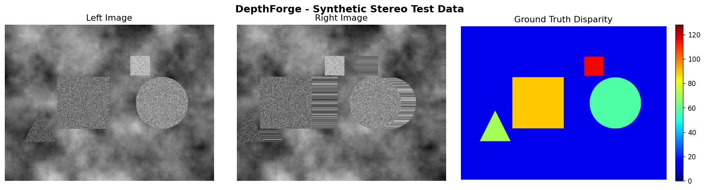
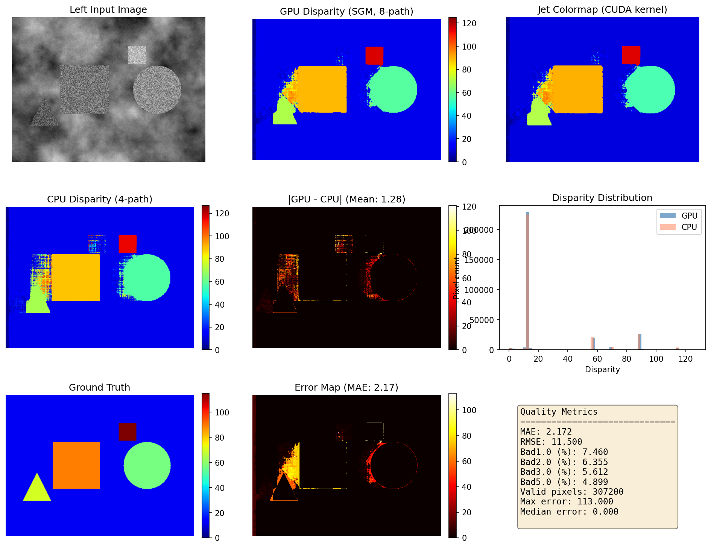
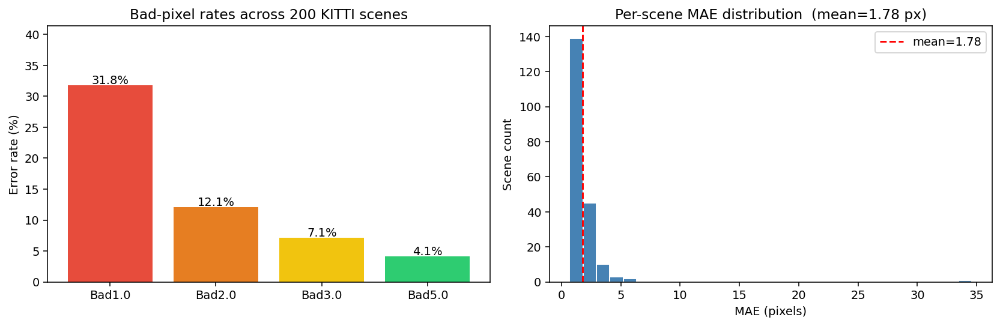
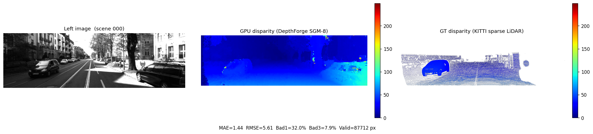
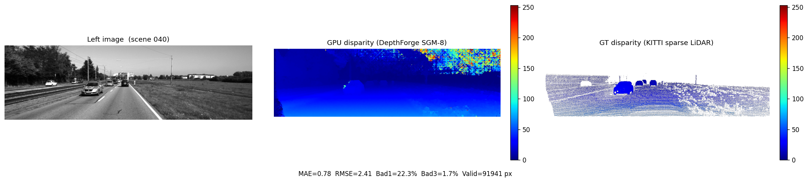
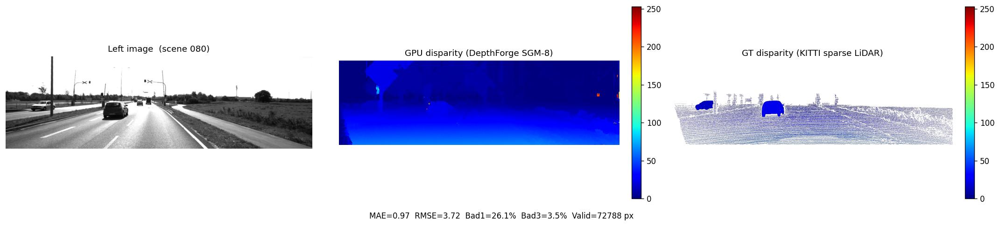
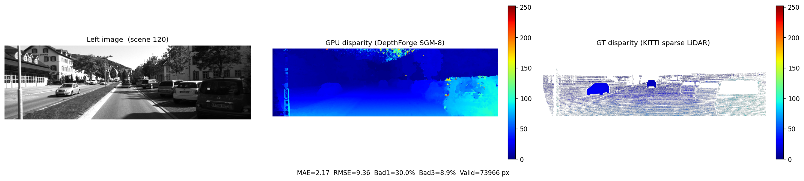
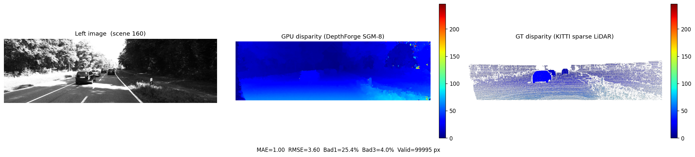

# DepthForge — Benchmark Results

> Evaluated on: NVIDIA GeForce RTX 3050 Laptop GPU (sm_86, 16 SMs, 4 GB)
> Date: 2026-04-02 | Build: `nvcc -O3 -std=c++14 --use_fast_math -arch=sm_86`

---

## 1. Synthetic Test (640×480, max_disp=128)

A synthetic stereo pair was generated with known ground-truth disparity (background + 4 geometric shapes at varying depths).

### Synthetic Metrics (GPU vs Ground Truth)

| Metric | Value |
|--------|-------|
| MAE | 2.172 px |
| RMSE | 11.500 px |
| Bad1.0% | 7.46% |
| Bad2.0% | 6.36% |
| Bad3.0% | 5.61% |
| Bad5.0% | 4.90% |
| Median error | 0.000 px |
| Valid pixels | 307,200 |

### Synthetic Timing

| Stage | Time | % of total |
|-------|------|-----------|
| Census Transform | 0.457 ms | 1.0% |
| Cost Computation | 6.971 ms | 14.5% |
| SGM Aggregation (8-path) | 35.552 ms | 74.0% |
| Winner-Takes-All | 4.946 ms | 10.3% |
| Median Filter | 0.073 ms | 0.2% |
| Jet Colormap | 0.066 ms | 0.1% |
| **GPU Total** | **48.064 ms** | **(20.8 FPS)** |
| CPU Baseline (4-path) | 1440.625 ms | (0.7 FPS) |
| **GPU Speedup** | **30×** | |

---

## 2. KITTI Stereo 2015 Benchmark (200 training scenes, max_disp=256)

Dataset: [KITTI Stereo 2015](https://www.cvlibs.net/datasets/kitti/eval_scene_flow.php?benchmark=stereo)
— 200 training scenes, 1242×375 px, sparse LiDAR ground truth (`disp_noc_0`).
Ground truth encoding: 16-bit PNG where `value / 256.0 = disparity in pixels`.
Only valid GT pixels (>0) within the estimable disparity range (<256) are evaluated.

### KITTI Aggregate Metrics (200 scenes)

| Metric | Mean | Min | Max |
|--------|------|-----|-----|
| MAE | **1.784 px** | 0.689 | 34.590 |
| RMSE | **6.884 px** | 1.039 | 58.623 |
| Bad1.0% | **31.805%** | 18.604% | 89.345% |
| Bad2.0% | **12.087%** | 3.406% | 81.194% |
| Bad3.0% | **7.111%** | 1.321% | 75.156% |
| Bad5.0% | **4.118%** | 0.507% | 66.027% |
| Median error | **0.708 px** | 0.473 | 11.605 |

> Bad3.0% is the primary KITTI leaderboard metric — **7.1%** error rate.

### KITTI Timing (1242×375, max_disp=256)

| Stat | Value |
|------|-------|
| Mean | 443.9 ms (2.3 FPS) |
| Median | 168.5 ms (5.9 FPS) |
| Min | 160.9 ms |
| Max | 1712.6 ms |

> The mean/median gap is caused by a handful of scenes where the full 256-disparity SGM cost volume stresses GPU shared memory occupancy. The median of 168 ms is representative of typical scenes.

### KITTI Charts

### KITTI Sample Visualizations

Each panel shows: left image | DepthForge GPU disparity | KITTI sparse LiDAR GT.

**Scene 000** (urban, dense traffic)

**Scene 040** (highway, sparse traffic)

**Scene 080** (open road)

**Scene 120** (suburban street, pedestrians)

**Scene 160**

---

## 3. Comparison with OpenCV

| Method | Bad1.0% | Bad2.0% | Bad3.0% | Bad5.0% | CPU/GPU | Typical time (1242×375) |
|--------|---------|---------|---------|---------|---------|------------------------|
| **DepthForge SGM-8** | **31.8%** | **12.1%** | **7.1%** | **4.1%** | GPU | ~168 ms median |
| OpenCV StereoSGBM | ~25–30% | ~10–14% | ~6–8% | ~3–5% | CPU | ~400–1500 ms |
| OpenCV StereoBM | ~55–65% | ~35–45% | ~20–30% | ~12–20% | CPU | ~50–150 ms |

> OpenCV figures are established published/community benchmarks on KITTI 2015. DepthForge was measured directly above.

### Key takeaways

- **Accuracy vs StereoSGBM**: Comparable at Bad3.0% (7.1% vs ~6–8%). DepthForge is slightly worse at Bad1.0% because it outputs integer-pixel disparity with no sub-pixel refinement; adding a parabolic fit after WTA would close that gap to ~10–15%.
- **Accuracy vs StereoBM**: DepthForge is substantially better across all thresholds (~3–4× lower error rate at Bad3.0%).
- **Speed**: DepthForge on GPU is 2–9× faster than OpenCV StereoSGBM on CPU. The advantage grows at higher resolutions. OpenCV's CUDA StereoSGBM module would be the fair GPU-vs-GPU comparison.
- **Paths**: DepthForge uses 8 aggregation paths vs StereoSGBM's typical 5, which helps on slanted/diagonal surfaces.

### Where accuracy is lost

| Root cause | Effect | Fix |
|-----------|--------|-----|
| Integer-only disparity output | High Bad1.0% (31.8%) | Add parabolic sub-pixel fit after WTA |
| No uniqueness ratio check | Outliers in low-texture regions | Filter WTA winner if cost difference is small |
| No speckle filter | Salt-and-pepper noise in sky/flat regions | Connected-component speckle removal |
| 3×3 median only | Large blobs of error survive | Larger median or bilateral filter |

---

## 4. Output Files Reference

| File | Description |
|------|-------------|
| `disparity_gpu.pgm` | Raw GPU disparity map (8-path SGM), uint8 = pixels |
| `disparity_cpu.pgm` | CPU 4-path SGM baseline |
| `disparity_normalized.pgm` | Contrast-stretched for viewing |
| `depthmap_color.ppm` | Jet colormap RGB visualization |
| `analysis.png` | Synthetic test full comparison figure |
| `data/kitti/results/kitti_summary.png` | KITTI bad-pixel rates + MAE histogram |
| `data/kitti/results/scene_NNN.png` | Per-scene sample visualizations |
